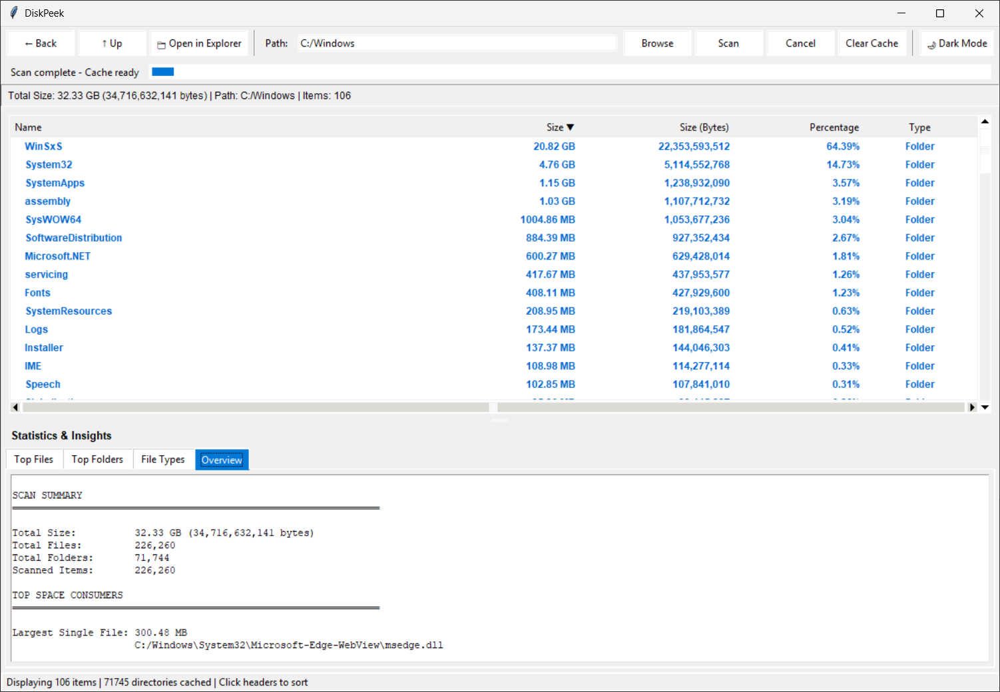

# DiskPeek

A lightweight, zero-dependency GUI application for visualising disk space usage on Windows, macOS, and Linux. Browse your directory tree sorted by size, identify the largest files and folders instantly, and explore file type breakdowns — all from a clean dark/light themed interface.

---



---

## What it does

- Recursively scans any directory and displays all contents sorted by size
- Drill down into subdirectories with double-click navigation; Back and Up buttons keep your place
- Caches the full scan so navigation is instant without re-scanning
- Tracks the top 100 largest files and folders using an efficient min-heap
- Shows a File Types breakdown: extension, file count, total size, and percentage of total scan size
- Includes an Overview tab with total size, file/folder counts, largest file, largest folder, most common file type, and average file size
- Opens folders and files directly in your system file manager
- Lets you copy any selected path with the right-click context menu
- Supports cancelling scans cleanly
- Includes light and dark themes

---

## Requirements

- Python 3.10 or newer
- No third-party packages required

This app uses `tkinter`, which is part of Python’s standard library and available on Windows, macOS, and most Unix platforms. You can test whether it is installed with:

```bash
python -m tkinter
```

On some Linux distributions, you may need to install the Tk package separately:

```bash
sudo apt install python3-tk
```

or

```bash
sudo dnf install python3-tkinter
```

---

## Usage

Run the script:

```bash
python diskpeek.py
```

### Typical workflow

1. Click **Browse** or type a directory path
2. Click **Scan**
3. Double-click any folder to drill into it
4. Use **← Back** and **↑ Up** to navigate
5. Review the lower statistics tabs for:
   - Top Files
   - Top Folders
   - File Types
   - Overview
6. Use **📁 Open in Explorer** to open the current folder in your file manager
7. Right-click any row to open it or copy its full path
8. Click **Clear Cache** to reset the scan and start over

---

## Features

### Fast cached navigation

The application scans the full tree once and caches directory contents in memory. After the initial scan, browsing between folders is immediate.

### Statistics and insights

The bottom panel provides four views:

- **Top Files** — largest files found anywhere under the scanned root
- **Top Folders** — largest folders by total size
- **File Types** — largest extensions by total size and count
- **Overview** — plain-text summary of the scan

### Cross-platform file manager integration

- **Windows:** opens Explorer and selects files when possible
- **macOS:** reveals files in Finder
- **Linux:** opens the path in the default file manager via `xdg-open`

### Themes

A built-in toggle switches between light and dark mode.

---

## Interface

| Area | Description |
|------|-------------|
| Top toolbar | Path entry, Browse, Scan, Cancel, Clear Cache, theme toggle |
| Progress area | Indeterminate progress bar and scanned item counter |
| Info bar | Total size, current path, visible item count |
| Main tree | Name, Size, Size (Bytes), Percentage, Type |
| Top Files tab | Largest files in the scanned tree |
| Top Folders tab | Largest folders in the scanned tree |
| File Types tab | Top extensions by total size |
| Overview tab | Plain-text scan summary |
| Status bar | Scan/cache status and general actions |

---

## Configuration

Two values near the top of the script are intended for easy adjustment:

```python
PROGRESS_CALLBACK_INTERVAL = 1000
sys.setrecursionlimit(5000)
```

### `PROGRESS_CALLBACK_INTERVAL`

Controls how often the progress label updates while scanning.

- Lower values = more frequent UI updates
- Higher values = slightly less UI overhead during large scans

### `sys.setrecursionlimit(5000)`

Sets the maximum recursion depth for very deeply nested directory trees.

If you work with unusually deep folder structures, you can increase this value.

---

## Notes

- Symlinks are not followed during scanning
- Permission errors and inaccessible files/folders are skipped
- Large trees can take time to scan depending on storage speed and file count
- The scan runs in a background thread so the UI remains responsive

---

## Suggested repository topics

`python` `tkinter` `disk-usage` `disk-analyzer` `disk-space` `gui` `filesystem` `desktop-app`

---

## License

Copyright (C) 2026 minn0x  
Licensed under the [GNU General Public License v3.0](LICENSE)
